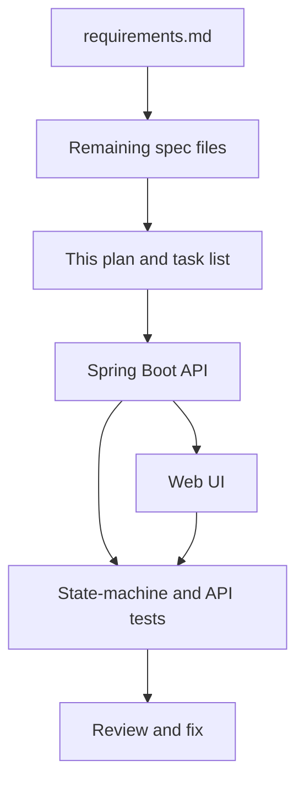

# Implementation Plan

**Status:** Approved  
**Workflow phase:** Plan / Tasks  
**Authoritative product source:** `spec/requirements.md` (derived from `doc/Assessments.pdf`)  
**Last updated:** 2026-09-23

## 1. Purpose

Define how the Support Ticket Management System will be delivered after requirements. This plan does not implement the application. Implementation starts only after the complete specification pack passes review.

## 2. Current state

Completed:

- Reusable Cursor rules, skills, and command wrappers
- All seven required specification artifacts
- Approved Phase 0 product decisions
- Full specification review with blocking findings corrected
- Prompt-history files and AI validation log
- Initial requirements-only specification review

Completed through Phase 7, including T-024:

- Application code, API tests, frontend tests, reviews, and evidence pack
- PostgreSQL restart persistence proven against a durable volume (`docs/t-024-postgresql-restart.md`)

## 3. Approach

- Keep a Spring Boot Java 21 backend as the authority for validation, persistence, and status transitions.
- Keep a separate React with Vite frontend that talks to the REST API.
- Use PostgreSQL for the default durable runtime. Use H2 only where the test strategy allows it and restart persistence is not being claimed from an in-memory store.
- Implement vertical slices that each leave a testable API or UI path: create/list, details/update, comments, search/filter, status transitions.
- Enforce the ticket state machine in one domain service used by every write path.
- Record rejected AI suggestions and keep prompt history current.

## 4. Phases

| Phase | Name | Outcome |
| --- | --- | --- |
| 0 | Finish specification | Review findings applied; all seven `spec/` files exist; open decisions closed or explicitly deferred |
| 1 | Foundation | Repository layout, build files, config without secrets, database schema from `data-model.md` |
| 2 | Ticket core | Create, persist, list, get, update fields and assignee |
| 3 | Comments, search, filter | Comments, keyword search, status filter, combined query |
| 4 | State machine | Allowed transitions succeed; invalid transitions rejected with no state change |
| 5 | Frontend | UI flows from `ui-flow.md`; meaningful errors |
| 6 | Verification | Tests from `test-strategy.md`, including state-machine integration tests; restart persistence check |
| 7 | Review and fix | `/review-code`, `/review-spec`, defect fixes, evidence check |

## 5. Approved Phase 0 decisions

`spec/requirements.md` section 10 is authoritative. Phase 0 selected React with Vite, PostgreSQL runtime with H2 tests, explicit priority and field limits, paginated case-insensitive search, editable terminal tickets with terminal status, dedicated transition operations, UTC timestamps, and no optimistic-concurrency contract.

The remaining specifications define the corresponding data, API, UI, and test contracts. Changes to these decisions require updating affected specifications before implementation.

## 6. Risks

| Risk | Handling |
| --- | --- |
| Coding before remaining specs exist | Phase 0 is a hard gate |
| H2 used to claim restart persistence | AC-011 must be demonstrated against PostgreSQL |
| Status updated through a generic field-update path | Status changes go only through the transition use case |
| UI hides invalid transitions but backend does not reject them | Backend tests for invalid transitions are mandatory (`AC-010`, `AC-014`) |
| Secrets in local config | `.gitignore` and a secrets review before calling the work complete |

## 7. Verification against acceptance criteria

| Criterion | Proven by |
| --- | --- |
| AC-001 to AC-006, AC-013 | UI flow plus API tests |
| AC-007, AC-008 | Search and filter API tests plus UI |
| AC-009, AC-010, AC-014 | State-machine integration tests |
| AC-011 | Restart against PostgreSQL |
| AC-012 | Backend validation tests |
| AC-015 | Repository scan; no credential files committed |

## 8. Explicitly not this phase

- Application source code
- Database migrations beyond what Phase 0 specifies
- Dependency installation unless required to write the spec or plan
- Changing approved product decisions without updating specifications
