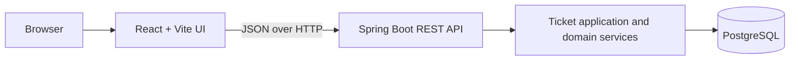

# Architecture

**Status:** Approved for implementation  
**Sources:** all specification files in `spec/`  
**Last updated:** 2026-09-23

## 1. System shape

Use a repository with two applications:

- `backend/` — Java 21 Spring Boot REST API.
- `frontend/` — React with Vite and TypeScript.

PostgreSQL is the default durable database. H2 is restricted to compatible automated tests.



## 2. Backend boundaries

Use package-by-feature under one base package:

```text
backend/src/main/java/.../
├── ticket/
│   ├── api/
│   ├── application/
│   ├── domain/
│   └── persistence/
└── shared/
    └── error/
```

Responsibilities:

- `ticket.api` — controllers, request/response DTOs, HTTP mapping, validation annotations.
- `ticket.application` — use cases, transaction boundaries, DTO/entity mapping orchestration.
- `ticket.domain` — ticket status and priority types plus the single transition policy.
- `ticket.persistence` — JPA entities and repositories.
- `shared.error` — centralized exception-to-`ProblemDetail` mapping.

Controllers do not call repositories directly. API DTOs are not JPA entities.
JSON deserialization is configured to reject unknown properties so protected fields such as `status` cannot be silently ignored on create or generic update.

## 3. Use cases

The application layer exposes focused operations:

- Create ticket.
- List/search/filter tickets.
- Get ticket details.
- Update editable fields.
- Add comment.
- Transition ticket status.

Status is absent from create and generic update commands. Only the transition use case invokes the domain transition policy and changes status.

## 4. Transaction boundaries

- Each mutation is one service transaction.
- Create ticket commits one ticket.
- Update fields changes one ticket.
- Add comment verifies the ticket and adds one comment atomically.
- Transition validates and updates status atomically.
- Read operations are read-only transactions where needed for consistent comment loading.
- A rejected transition exits without a write.

## 5. Persistence

- Spring Data JPA provides repository access.
- PostgreSQL is configured by environment variables; credentials are never committed.
- Schema evolution uses versioned migrations so restart behavior is deterministic.
- Enum values are persisted as strings.
- UTC instants are used for timestamps.
- The schema and indexes follow `data-model.md`.

H2 tests must not be treated as proof of PostgreSQL-specific behavior. AC-011 is verified against the durable PostgreSQL runtime.

## 6. Frontend boundaries

Use React, Vite, and TypeScript:

```text
frontend/src/
├── api/
├── components/
├── features/tickets/
├── pages/
└── types/
```

Responsibilities:

- `api` — one fetch wrapper, response decoding, and normalized problem errors.
- `features/tickets` — ticket forms, list/filter controls, comments, and transition actions.
- `pages` — list, create, and detail page composition.
- `components` — reusable presentational UI only when reuse is real.
- `types` — API-facing TypeScript types aligned with `api-contract.md`.

The backend remains authoritative. Client-side validation improves feedback but never replaces backend handling.

## 7. UI navigation

Use client-side routes:

- `/tickets` — list, search, and status filter.
- `/tickets/new` — create ticket.
- `/tickets/:ticketId` — detail, edit fields, comments, and valid transitions.
- Unknown application routes show a local not-found view.

## 8. Error flow

1. Backend maps known failures to the problem contract.
2. The frontend API wrapper parses `application/problem+json`.
3. Field errors are attached to form fields where possible.
4. Domain, not-found, connectivity, and unexpected errors display safe page or action feedback.
5. A failed mutation does not update the UI as though it succeeded.

## 9. Configuration and security

- Runtime values come from environment variables or uncommitted local configuration.
- Commit an environment example containing names and safe placeholders only.
- Restrict CORS to the configured frontend origin; do not use wildcard CORS.
- Do not expose stack traces or framework details.
- Validate all client input.
- Authentication is intentionally out of scope; the API must not pretend to enforce user identity.

## 10. Initial dependency policy

Backend dependencies should be limited to:

- Spring Web
- Spring Validation
- Spring Data JPA
- PostgreSQL driver
- H2 test runtime
- A migration tool if used to create the approved schema
- Spring Boot test support

Frontend dependencies should remain within the generated React/Vite toolchain unless a specification requires more. Do not add a state-management or UI framework for this assessment-sized application without evidence.

## 11. Architecture decisions

### React with Vite, not Next.js

The product is a client-side support tool with no SEO, server rendering, or server-side frontend requirement. Vite is the smaller sufficient choice.

### PostgreSQL default, H2 tests

PostgreSQL gives a clear durable runtime for AC-011. H2 keeps compatible tests fast but is not the persistence proof.

### REST problem details

One structured error contract supports meaningful UI errors and stable integration tests.

### Dedicated transition operation

Separating status transitions from generic updates makes the state-machine boundary explicit and testable.

### No optimistic concurrency in the first version

The assessment does not require concurrent editing. Last successful write wins minimizes scope; concurrency control can be added only with a revised contract.

### No status-history entity

The assessment requires current status and comments, not an audit log. Adding history would expand schema and behavior without an acceptance criterion.

## 12. Quality gates

- All seven specification artifacts reviewed before source scaffolding.
- Backend unit and integration checks pass.
- Frontend lint, type checks, and tests pass.
- State-machine integration suite passes.
- Durable restart check passes.
- Code and specification reviews have no blocking findings.
- Repository secret scan is clean.
